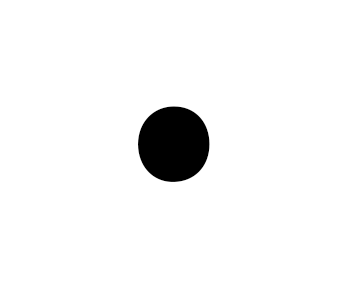

# ArduECO

## Edit: Publication
With the help of [Prof. Claudio Palazzi](https://www.math.unipd.it/~cpalazzi/), this work has been published on IEEE's 2nd International Workshop on Social (Media) Sensing (SMS 2020) under the name "Air Quality Control through Bike Sharing Fleets":
- [arXiv](https://arxiv.org/abs/2007.08305)
- [ResearchGate](https://www.researchgate.net/publication/343005675_Air_Quality_Control_through_Bike_Sharing_Fleets)
- [Slides](https://www.math.unipd.it/~cpalazzi/ArduECO/ArduECO%20IEEE%20Presentation%20FINAL.pdf)
- [Video Presentation](https://www.math.unipd.it/~cpalazzi/ArduECO/ArduECO.mp4)

## Introduction

ArduECO is an IoT device developed using a NodeMCU board programmed with Arduino's C/C++ capable of tracking the amount of *CO (Carbon Monoxide)* in the air with a MQ-7 sensor, along GPS position and send it in the cloud to AWS's *IoT Core* and an SD Card to keep the data until it is sent in the cloud. 
These are stored in a simple SQL database and displayed on a [website](ardueco.altervista.org) using [Google Maps JavaScript API's](https://developers.google.com/maps/documentation/javascript/tutorial).

This project has been created for the [Wireless Networks](https://www.math.unipd.it/~cpalazzi/retiwireless.html) course held by [Prof. Claudio Palazzi](https://www.math.unipd.it/~cpalazzi/), in the [Master's in Computer Science](http://informatica.math.unipd.it/laureamagistrale/indexen.html) at Università degli Studi di Padova.

The goal of this project was to develop a PoC of an easy way to keep track in real time of air quality using devices that can be easily installed on shared green methods of transportation such as bikes and electric scooters from companies like [Mobike]( https://mobike.com/global/).

Further information about the project can be found in the *[essay](essay/VOINEA_ARDUECO.pdf)* that presents the project.

## Schematics

The circuit have been designed using [Fritzing](https://fritzing.org/).

## Software

### Arduino external libraries

For interfacing with the peripherals attached to the board, this project uses these libraries:
- [SD Library](https://www.arduino.cc/en/reference/SD)
- [MQ-7 Library](https://github.com/swatish17/MQ7-Library)
- [GPS Library](https://www.arduinolibraries.info/libraries/tiny-gps), [usage instructions](https://www.instructables.com/id/How-to-Communicate-Neo-6M-GPS-to-Arduino/)

### AWS and website

AWS's IoT Core allows to use an [MQTT server](https://1sheeld.com/mqtt-protocol/) allowing devices to connect using a lightweitght protocol with minimized data packets, low network usage and low power usage.

Each device would have its own certificate in order to connect to the cloud, to do this I have followed the steps described in [this](https://electronicsinnovation.com/how-to-connect-nodemcu-esp8266-with-aws-iot-core-using-arduino-ide-mqtt/) tutorial.

The MQTT server is then connected to an AWS Lambda function, written in Python, which sends the information to a PHP page which inserts it in the database.
This is not an ideal setup but it was necessary since [Altervista](altervista.org), the host I have used for the [website](ardueco.altervista.org), does not allow external connections to its databases.
The Lambda function can be found in [web/lambda.py](web/lambda.py).

Using the [Google Maps JavaScript API's](https://developers.google.com/maps/documentation/javascript/tutorial) I have created a simple map with markers that sign where GPS positions have been registered along with CO readings from the MQ Sensor.

#### Database

For this project I have used SQL instead of others because it represents only a PoC.
A more suitable DB system would be Redis, thinking about this project can scale horizontaly with a greater number of devices.

The file with the database schema can be found in the [web/database.sql](web/database.sql) file.

## Improvements

Some improvements like creating a better algorithm for uploading data, using better hardware and using multiple air sensors can be found in the [essay](essay/VOINEA_ARDUECO.pdf) related with the project.
